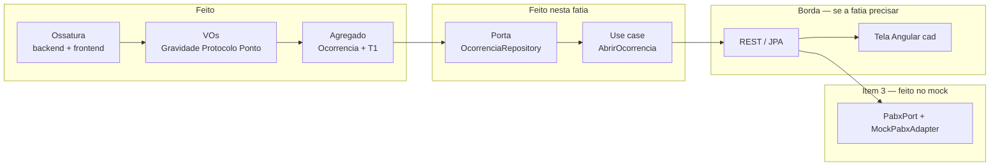
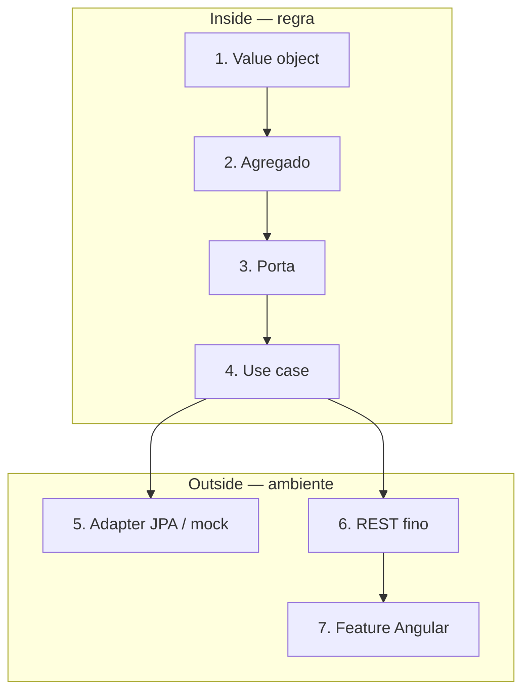
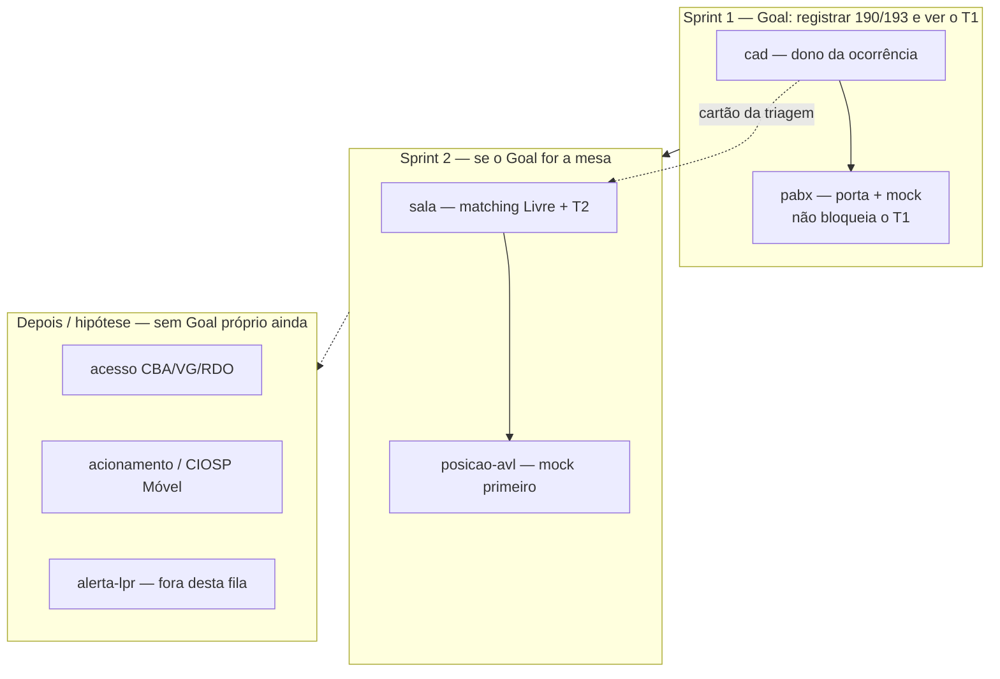

# Fluxo de desenvolvimento dos componentes

Como os módulos do mapa entram no código. Não é uma lista “um componente por vez até acabar o mapa”: é **fatia vertical**. Primeiro o `cad` (ocorrência + T1), de dentro para fora do hexágono. Os outros só entram quando o backlog pedir.

Fonte do mapa: `docs/architecture/component-map.md` no kit do curso. Estilo: monólito modular, um JAR (ADR 0001–0004).

## Onde estamos (2026-09-07)

Itens 1–3 + tela: `POST /ocorrencias` (T1) + `GET /pabx/chamada` + Angular `cad`. Persistência em memória até o JPA. PABX **real** não entra.

## Como nasce um componente

Cada módulo (`cad`, `pabx`, `sala`…) atravessa as mesmas camadas. A pasta grita o domínio; o Maven impede o núcleo de importar Spring.

Dependência Maven (sempre para dentro):

`infrastructure` → `application` → `domain`

Quem fala com o núcleo é só `UseCase.execute`. Persistência e PABX são portas (`OcorrenciaRepository`, `PabxPort`). O teste usa `InMemory*`; o JAR usa JPA ou mock.

Detalhe da esteira de arquivos: [fluxo-desenvolvimento-codigo.md](fluxo-desenvolvimento-codigo.md).

## Ordem dos componentes no produto

O mapa tem 8 módulos no **mesmo JAR**. Só se constrói o que a Sprint pede.

`auditoria-tempos` não é um serviço à parte: o T1 já mora no agregado `Ocorrencia`; T2 entra com a `sala`.

| Componente | Recorte | Estado |
|---|---|---|
| **cad** | o quê, onde, gravidade, T1 | Use case + `POST /ocorrencias` + tela Angular `cad` |
| **pabx** | mock; real só com homologação | `PabxPort` + `MockPabxAdapter`; `GET /pabx/chamada` |
| **sala** | mesa, Livre mais próxima, T2 | Sprint 2 |
| **posicao-avl** / **acionamento** | GPS e tablet; rádio é fallback | depois da Sprint 2 |
| **acesso** | isolamento de unidade | hipótese |
| **alerta-lpr** | não abre ocorrência | fora desta fila |

## Por que essa ordem

O hexágono força **invariante antes de framework**. Abrir ocorrência sem Spring prova o T1 no clique; PABX mudo (evento da oficina) não derruba o Goal. Matching e T2 não entram no `cad` — o atendente não escolhe viatura.

Sprint 1 (compromisso): itens 1–3 do backlog. Item 4 (encaminhar à mesa) só se sobrar capacidade. PABX real não entra.
