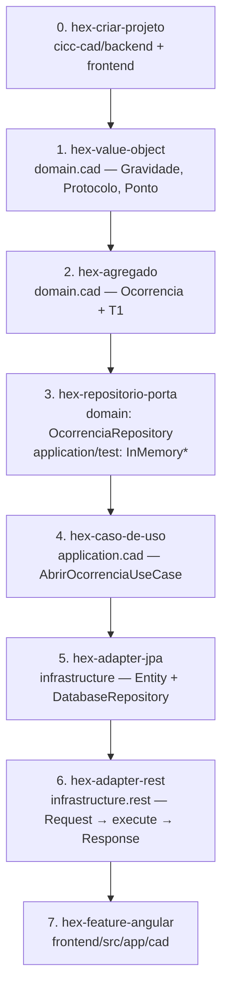
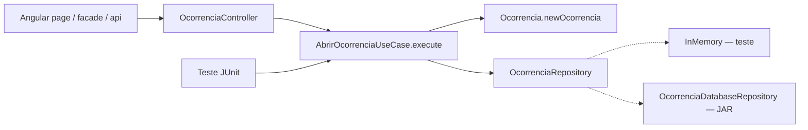

# Fluxo de desenvolvimento do código

A esteira hexagonal de **uma fatia**. Cada módulo do mapa (`cad` agora, `sala` depois) passa por estes passos. Não se começa pelo controller nem pela entidade JPA.

Skills no kit: `usar-estrutura-hexagonal` → `hex-criar-projeto` → `hex-value-object` → `hex-agregado` → `hex-repositorio-porta` → `hex-caso-de-uso` → `hex-adapter-jpa` → `hex-adapter-rest` → (`hex-feature-angular` se houver tela).

Visão dos módulos de negócio: [fluxo-componentes.md](fluxo-componentes.md).

## Esteira (skill → pasta)



| Passo | Onde o arquivo mora | Quem testa | Estado na fatia `cad` |
|---|---|---|---|
| 0 Ossatura | `backend/{domain,application,infrastructure}` + `frontend/` | `mvn test` dummy | Feito |
| 1 VO | `backend/domain/.../cad/` | `*Test` no domain, sem Spring | Feito |
| 2 Agregado | mesmo pacote | `OcorrenciaTest` | Feito |
| 3 Porta | interface no domain; fake em `application/src/test` | fake no unitário | Feito |
| 4 Use case | `backend/application/.../cad/` | `new UseCase(new InMemory*)` | Feito |
| 5 JPA | `infrastructure/persistence` | IT, não o unitário | Depois (agora InMemory no JAR) |
| 6 REST | `infrastructure/rest` | MockMvc | Feito |
| 7 Tela | `frontend/src/app/cad/` | `*.spec.ts` | Feito (abrir + T1 na tela) |

`pabx` já passou pelo ciclo da porta: `PabxPort` + `InMemoryPabxPort` no teste + `MockPabxAdapter` no JAR. Adapter Intelbras fica para homologação.

## Quem chama quem (quando o código existir)



Setas de **chamada** podem ir para fora. Setas de **dependência Maven** só para dentro: `infrastructure` → `application` → `domain`. Se o domain importar Spring ou use case, o `mvn compile` deve falhar.

## O que cada camada tem o direito de fazer

```text
domain          invariante (gravidade, T1, ponto). Sem @Entity, sem SDO_GEOMETRY.
application     orquestra: unicidade de protocolo + newOcorrencia + criar na porta.
                Input/Output são primitivos. Não devolve o agregado. Não chama outro use case.
infrastructure  traduz: Request↔Input, Entity↔restore, PABX/AVL timeout.
frontend        tela. Autoridade da regra continua no backend.
```

O primeiro usuário do núcleo é o **teste**, não o controller. Por isso a porta e o `InMemory*` vêm **antes** do REST: o `AbrirOcorrenciaUseCase` já prova “abrir à mão + T1 no clique” sem Boot e sem Oracle.

## Próximo commit de código

Item 5: sugerir Livre (AVL mock) + empenhar + T2. Persistência ainda é InMemory. Seguinte: fila sem Livre (item 6) ou “No local” (item 7). Sem JPA ainda.
