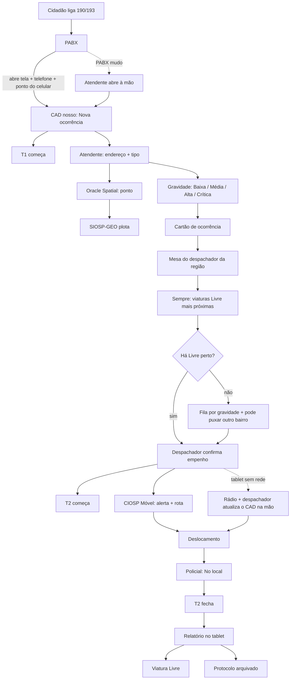

# Jornada de ponta a ponta

To-be do CAD nosso + PABX (ADR 0002). Ponto gravado em **Oracle Spatial** (ADR 0003); SIOSP-GEO é a tela do mapa.

**T1** começa na Fase 1 (ligação/abertura da ocorrência). **T2** começa no despacho e fecha no “No local”.

## Fase 1 — Entrada (190/193)

| Quem | O que faz | Gatilho do sistema |
|---|---|---|
| Cidadão | Liga 190 (PM) ou 193 (Bombeiros) | PABX entrega a ligação |
| Sistema | Abre **Nova ocorrência**; preenche telefone e, se houver, lat/long do celular | Porta `pabx`. Reverse geocode escreve **Onde**. T1 no clique |
| Atendente | Confirma ou ajusta o ponto; informa ponto de referência | Clique no mapa recalcula o endereço; referência plota um segundo pino |

Se o PABX falhar ou a ligação não trouxer coordenada: atendente abre à mão; T1 no clique. Telefone e ponto ficam vazios até alguém informar. Origem da ligação **pode não** ser o local da ocorrência.

## Fase 2 — Triagem e classificação

| Quem | O que faz | Gatilho do sistema |
|---|---|---|
| Atendente | Classifica pelo relato (ex.: furto passado vs. roubo armado agora) | Gravidade **Baixa / Média / Alta / Crítica** |
| Sistema | Fecha o cartão virtual | Encaminha à **mesa do despachador da região/bairro** |

Atendente **não** escolhe viatura.

## Fase 3 — Despacho e campo

| Quem | O que faz | Gatilho do sistema |
|---|---|---|
| Despachador (CICC) | Vê mapa + AVL; confirma a **Livre mais próxima** (bairro é mesa, não cerca) | Status → **Viatura empenhada**; T2 começa |
| Sistema | Alerta + rota no CIOSP Móvel | Tablet da viatura |
| Sistema / despachador | Sem Livre nas proximidades | **Fila por gravidade** (Crítica primeiro) **e** pode puxar viatura de outro bairro — ainda pela proximidade |
| Guarnição | Desloca; clica **No local** | T2 fecha |
| Despachador | Tablet sem rede | **Rádio** + **atualiza o CAD na mão** (status, empenho, No local se a rua não clicar) |

## Fase 4 — Encerramento

| Quem | O que faz | Gatilho do sistema |
|---|---|---|
| Guarnição | Resolve no local; digita relatório no tablet | — |
| Sistema | Encerra o caso; viatura volta a **Livre**; protocolo arquivado | Base para estatística / mancha criminal (depois do piloto operacional) |

## Estados da viatura (mock)

`Livre` → `Empenhada` → `No local` → `Livre`  
`Fora de serviço` fica de fora do matching. Relatório de campo e estatística ficam fora deste recorte.

## Exceções (fechadas)

1. **Sem Livre “na região”:** as duas ações valem. O sistema **sempre busca as viaturas mais próximas** (Oracle Spatial / AVL). Bairro/região define a *mesa* do despachador, não trava o matching. Se não houver Livre perto: chamado **entra na fila por gravidade** (Crítica → Alta → Média → Baixa) e o despachador **pode puxar de outro bairro**, ainda pela proximidade. Quem empilha é o sistema; quem empenha é o despachador.
2. **Tablet sem rede:** regra oficial. Despacho por **rádio**; o **despachador atualiza o CAD na mão**. T2 pode fechar no clique do tablet *ou* no registro manual do despachador. Marcar o carimbo como manual quando não veio do móvel.

Cabine Lilás (violência doméstica em paralelo) continua variação: não atrasa a Fase 3.

## Recorte do piloto

CBA / VG / RDO. CAD nosso. LPR não aparece neste fluxo feliz (alerta na sala, não abre ocorrência). Facial/CPF fora.
